# Workout Creator

The Workout Creator is a Python program that helps users generate personalized, full-body workout routines including warm-up, main workout, and cool-down.

Here is the live version of my project: [Link to the Workout Creator Program](https://workout-creator-228871cd4fa2.herokuapp.com/)

 

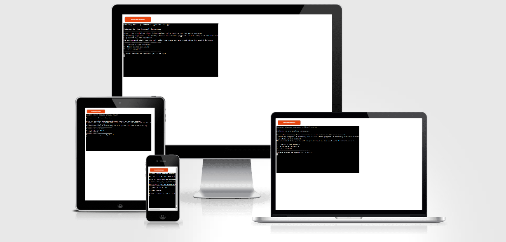

## **How to use**

The Workout Creator is designed to be simple and user-friendly. Users can specify their desired workout duration and select a difficulty level (easy, medium, hard). Based on these inputs, the program generates a complete workout plan.

1. **Start the Program**: Run the program in your terminal to be greeted by the main menu.
2. **Create a Workout**: Choose the workout duration (between 10 and 60 minutes) and the difficulty level (easy, medium, hard).
   The program will generate exercises targeting different muscle groups.
3. **Save and View Workouts**: You can save generated workout and access them later.
4. **Importance of Warm-Up and Cool-Down**: Every workout includes fixed warm-up and cool-down to help prevent injury and promote muscle recovery.

## **Briefing**

### Workout Creator Program

The Workout Creator Program helps individuals generate customized full-body workout plans tailored to their preferences, such as duration and difficulty level. The goal is to make fitness accessible and efficient, enabling users to generate well-rounded exercise routines that include warm-up, targeted main workouts, and a cool-down session. This approach encourages balanced fitness and structured exercise habits, ensuring users can train effectively with minimal planning effort.

### Planning

The Workout Generator aims to simplify the process of creating and planning workout routines. It considers user input, including training time and preferred difficulty level, to generate a balanced training plan that targets major muscle groups. The program is intended for anyone interested in at-home or gym workouts, with a focus on bodyweight exercises to ensure accessibility.

The main elements of the workout include:

- **Warm-Up**: Suggested exercises to prepare the body for the workout.
- **Main Workout**: Focused on full-body exercises tailored to the selected difficulty level and duration.
- **Cool-Down**: Recommended exercises to stretch and relax muscles post-training.

The program ensures that the exercises selected fit the duration entered by the user and adapt based on the difficulty level. Warm-up and cool-down sessions are fixed at approximately 5 minutes each to avoid injury and promote muscle recovery.

## **User Experience**

### Ease of Use and Guidance

The Workout Generator is easy to use, with simple prompts guiding the user through each step of generating a workout. Users are welcomed with a menu to either create a new workout, view saved workouts, or exit the program. Upon choosing to create a workout, users are prompted to enter the desired workout duration, select a difficulty level, and generate their workout.

The user-friendly interface and informative messages ensure that even beginners can effectively use the program. Clear error messages and input validation prevent mistakes, making the experience smooth and frustration-free.

## **Features**

### Existing Features

**User-Friendly Menus**:

- The main menu allows users to create a new workout, view saved workouts, or exit the program.

 

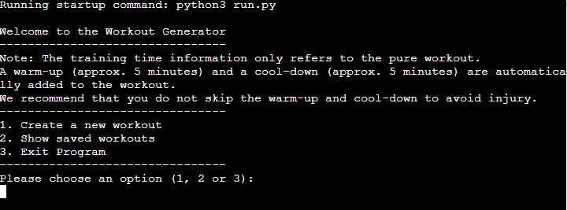

**Workout Customization**:

- Users can enter a desired workout duration (between 10 and 60 minutes) and select their preferred difficulty level (easy, medium, or hard). The workout is then created based on these inputs, including a warm-up, main workout, and cool-down.

 

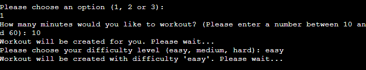

**Random Exercise Selection**:

- Exercises are selected randomly from predefined categories, ensuring variety.

**Warm-Up and Cool-Down**:

- The program always includes a warm-up and cool-down to ensure the user is well-prepared and can safely recover. Each takes approximately 5 minutes and consists of basic stretching and mobility exercises.

 

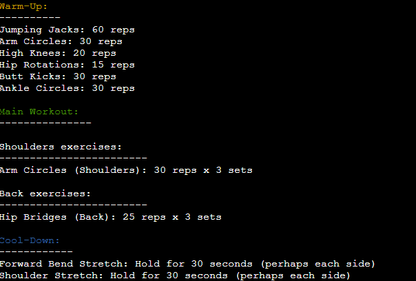

**Input Validation**:

- Ensures users enter valid numbers and choices throughout the program. Clear prompts guide the user when invalid inputs are detected, ensuring a smooth experience.

 

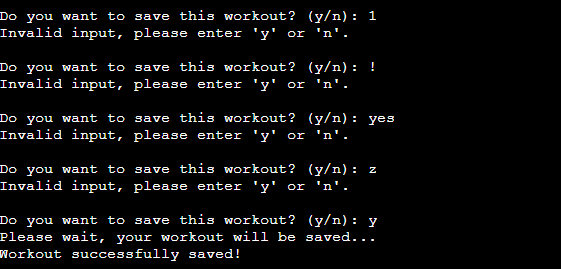

**Save and View previous Workouts**:

- Users can save workouts and view them later for tracking progress.

 

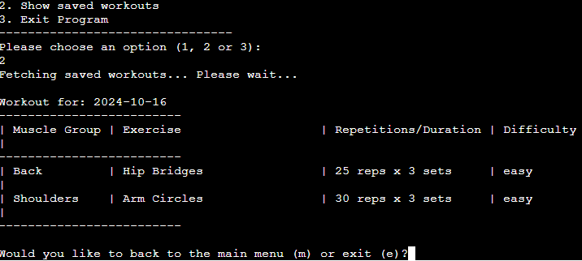

### Future Features

- **Exercise Customization**: Allow users to choose and add specific exercises or muscle groups, providing more control over their workout plans.
- **Difficulty Progression**: Track user progress and recommend gradually increasing workout intensity to support fitness growth.
- **Integrated Timer**: Add a timer to help users keep track of workout sets and rest periods.
- **Workout Analytics**: Provide insights and analysis of saved workout sessions to help users track their fitness journey and make informed decisions about their training.

## **Structuring**

### Flowchart Structure

The structure of the Workout Generator Program is laid out through basic flowcharts that demonstrate the flow from input to output, ensuring clear visualization of user interaction and program decisions.

 

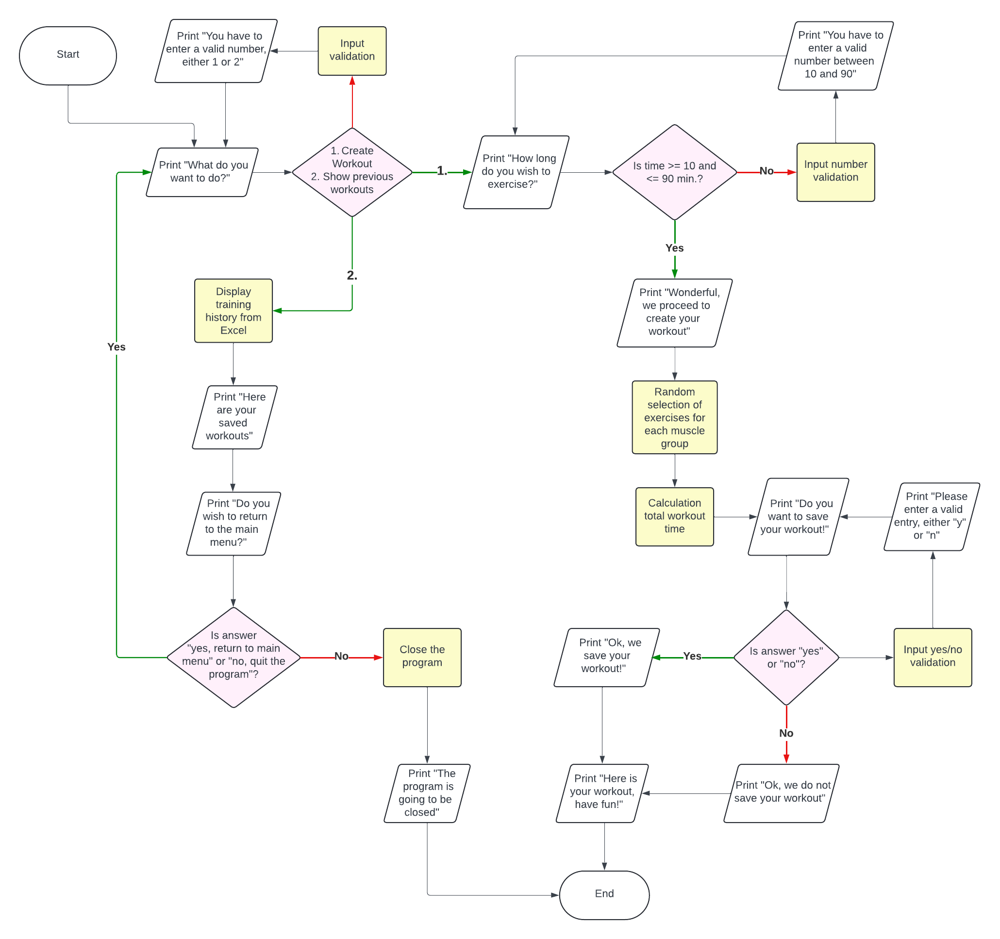

## **Technologies**

### Python

- Used for creating core logic of the program.

### Google Sheets API (gspread)

- Manages storage and retrieval of workout data, including exercises and user-generated workouts.

### Flake8

- Used as a PEP8 control tool to ensure code quality and provide constant feedback on pythonic style.

### gspread

- Used the Python module to interact with Google Sheets.

### datetime

-  Used to record the date and time of generated workouts for tracking purposes.

### Visual Studio Code

- Used for writing, debugging, and testing the Python code.

### GitHub

- Used for version control and project repository management.

## **Data Model**

The workout data is stored in a Google Sheet using the gspread libary. The Google Sheet maintains information
on exercises, difficulty levels, sets, repetitions and saved workouts. Each entry is time-stamped to allow users
to keep track of their workout history.

The program retrieves exercises from separate worksheets for warm-up, main exercises and cool-down. Depending on
the difficulty level, the program selects different exercises to generate a balanced routine.

## **Testing**

### General (Manual) Testing

|       General Testing       |                        Testing Method                        |                                  Expected result                                  | Actual result |
| :-------------------------: | :----------------------------------------------------------: | :-------------------------------------------------------------------------------: | :-----------: |
|    User Input Validation    | Entering invalid input values (e.g., text in numeric fields) |             Program should prompt the user to re-enter correct input              |     Pass      |
| Workout Duration Validation | Entering a workout duration less than 10 or greater than 60  |             Program should prompt the user to enter a valid duration              |     Pass      |
|  Menu Selection Validation  |               Selecting incorrect menu options               |              Program should prompt the user to enter a valid option               |     Pass      |
|       Saving Workouts       |                 Saving and viewing a workout                 | Workout details should be saved correctly in Google Sheets and displayed properly |     Pass      |

I have also manually tested this project by doing the following:

- Entered valid and invalid inputs to ensure the program handles errors correctly.
- Created workouts of different durations and difficulty levels to ensure the generated plans fit the specified parameters.
- Saved multiple workouts and checked if they were stored correctly in the Google Sheet.
- Verified that the static exercises (e.g., holds) display the correct duration in the saved workouts.

## **Validator Testing**

### Flake8

- The code was checked for errors using the Flake8 extension for Visual Studio Code as a PEP8 control tool. No errors occurred while testing the final product.

 

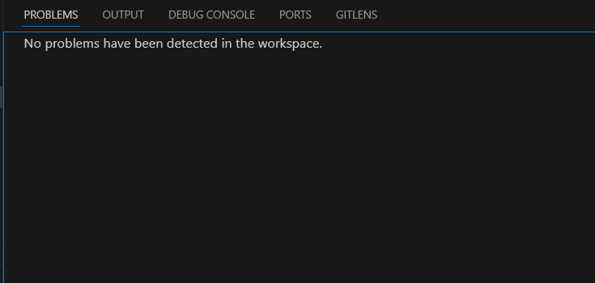

### CI Python Linter

- The code was checked for errors using the Code Institute Python Linter. No errors occurred while testing the final product.

 

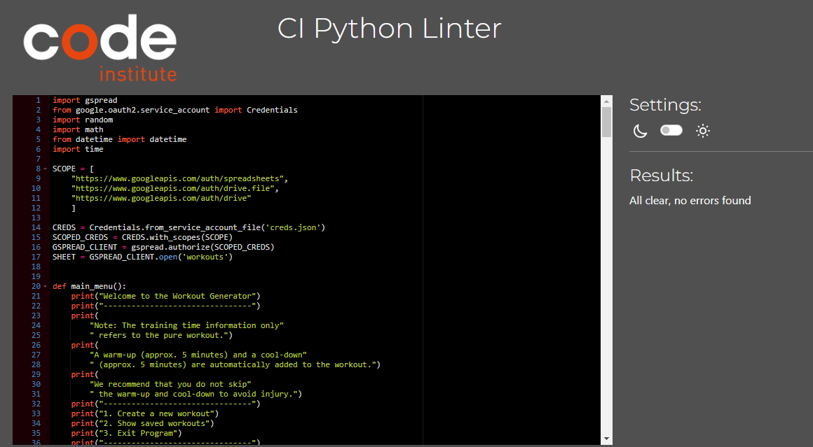

## **Bugs**

### Solved Bugs

- **Unsorted Workouts**: The generated workouts were initially unsorted, making it difficult to follow. The output was modified to organize exercises by category for better readability.
- **Single Category Issue**: In earlier versions, the generated workout included exercises only from a single category rather than a balanced selection across all categories. This was fixed by implementing a more comprehensive randomization mechanism.
- **Multiple Sets Handling**: The initial implementation only generated one set per exercise instead of the intended three sets. This was addressed by ensuring exercises are repeated for the correct number of sets.
- **Static Exercise Duration**: Initially, the program did not display static exercise hold times correctly during the cool-down phase. The issue was fixed by updating how static durations are formatted.
- **Endless Loop Issue**: Initially, the program would enter an endless loop through the exercises if the duration wasn't set properly. This was corrected by adding a proper break condition to the loop.
- **Workout Over Time Limit**: An issue where total workout time, including warm-up and cool-down, exceeded the user-defined duration was addressed by keeping warm-up and cool-down durations fixed while limiting the main workout to the user's input.

### Unfixed Bugs

- No known bugs as of the latest release. Users are encouraged to report any issues they encounter.

## **Deployment**

## GitHub

### Visual Studio Code connection

- A connection between Visual Studio Code and GitHub was established using the built-in function to include the ability to clone, stage, commit and push content directly to GitHub. Once you start Visual Studio Code with no connection, you simply need to click on the person icon in the lower left corner and select "GitHub". From there, you can connect your existing account to Visual Studio Code.

 

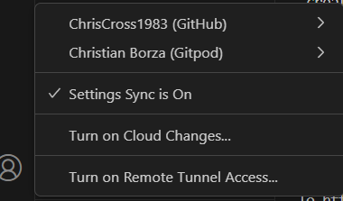

### Cloning, committing and pushing via Visual Studio Code

- Visual Studio Code was used to stage all changed files and commit them with an included message directly to GitHub.

 

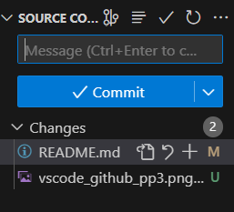

### Deployed page on GitHub

- The system is hosted via Heroku, but still available in the pages menu of GitHub.

 

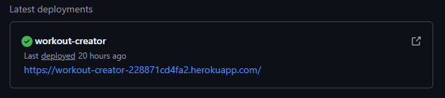

## Heroku

### Creating a new App

- In the dashboard, navigate to the button _New_ and _Create new app_.

 

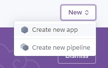

### Naming the app

- Give the app a new name and select the host region (US/EU). Then click _Create app_.

 

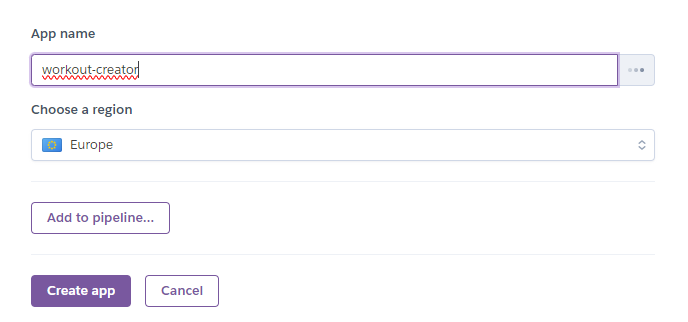

### Deploy the app

- Click on the _Deploy_ button on the top. In the bottom, select the platform on which the code is hosted, select the username and insert the name of the repository. GitHub was chosen here.

 

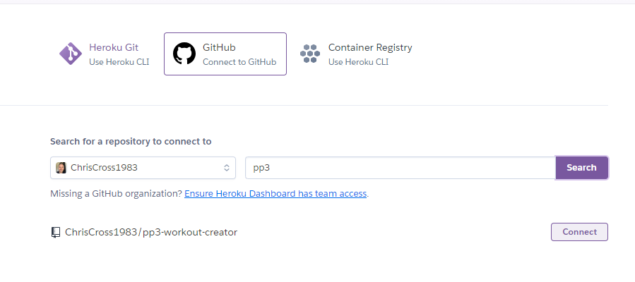

### Configure possible Config Vars

- Config vars are a way to securely store need information for connections like the MySQL connection used in this project. Insert a key and value pair and add it.

 

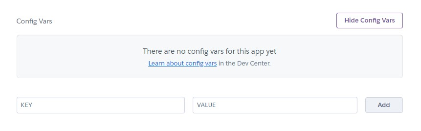

### Add buildpacks to the project

- Buildpacks are needed to use the Code Institute Python Template. Node.js and Python need to be added for it to work.

 

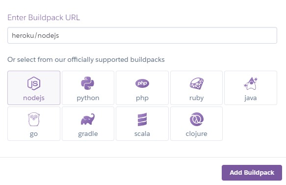

### Select a branch to deploy

- A GitHub branch that should be deployed can be found on the _Deploy_ page. Here, the main branch was used to create the project.

 

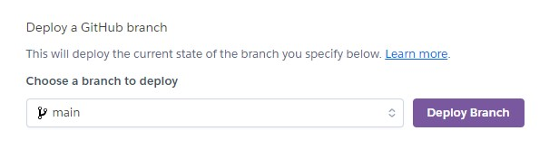

### Waiting for the project to deploy

- A window with all needed pieces of information will be displayed to inform the user of the current action. After successfully deploying the app, a _View_ button will appear. It contains the link to the live site.

 

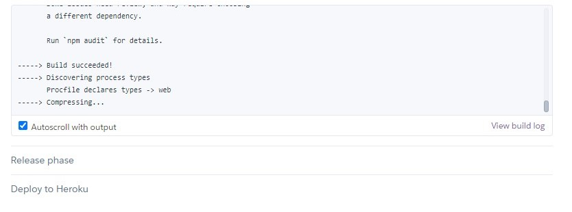

 

## **CREDITS**

### [Lucidchart](https://lucid.app/)

- Used to create flowcharts for the menu structure.

### [W3Schools](https://www.w3schools.com/)

- Used to lookup tips for the code.

### [YouTube](https://youtube.com)

- Videos for understanding some code areas.

### [ChatGPT](https://chatgpt.com/)

- Used for deepening the understanding of some Python concepts.

### [Visual Studio Code](https://code.visualstudio.com/)

- Used for code editing.
